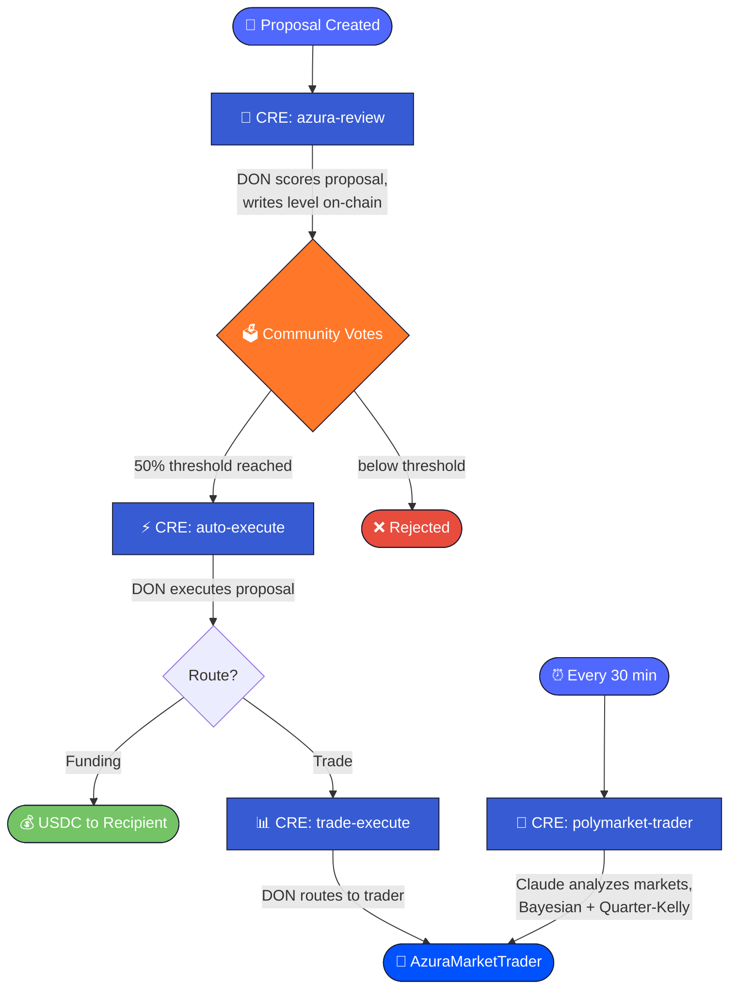

<div align="center">


# Mental Wealth Academy

**Decentralized Education, Micro-University For Humans & Machines Evolving Through Collectively Owned Cyberspace.**

[](https://nextjs.org/)
[](https://soliditylang.org/)
[](https://chain.link/)
[](https://base.org/)

</div>

---

## What This Is

A learning app with a transparent treasury where an AI Agent (Azura) scores funding proposals, community uses **Chainlink CRE workflows + ElizaOS to automate the pipeline** from review to autonomous executions -- min beaurocratic pressure required.

**Governance:** [`0x2cbb90a761ba64014b811be342b8ef01b471992d`](https://basescan.org/address/0x2cbb90a761ba64014b811be342b8ef01b471992d) (Base Mainnet)

---


https://github.com/user-attachments/assets/e111f509-1f39-4009-8c8e-b8beef6165a0


## What's The Most Advanced Stuff

### `/community`

The community governance hub. Members submit funding proposals, vote on-chain, and interact with **Azura** -- our AI governance agent.

- **Private Governance Calls** -- Azura reviews every proposal through the ElizaOS API, scoring across 6 dimensions (clarity, impact, feasibility, budget, ingenuity, chaos). Reviews are delivered on-chain via CRE workflow DON, making AI scoring tamper-proof.
- **On-chain Voting** -- Token-weighted community votes with a 50% threshold. Azura's approval level (1-4) determines her voting weight (10%-40%). Level 0 kills the proposal outright.

### `/markets`

The autonomous trading dashboard powered by a **CRE DON calling Polymarket**.

- **Bayesian Market Scanner** -- A CRE cron workflow runs every 30 minutes, using Anthropic Claude to identify mispriced prediction markets through expected value analysis, base rate estimation, and Bayes' theorem.
- **Quarter-Kelly Sizing** -- Conservative position sizing caps risk at 5% of the trading treasury per position.
- **Live Orderbooks** -- Real-time CLOB data from Polymarket displayed alongside the DON's active positions and trade history.
- **Governance Path** -- Trade proposals can also flow through community governance on `/community`, giving the DAO direct input on trading decisions.

---

## CRE Integration

Four CRE workflows run in the Chainlink DON, automating governance, AI review, and autonomous trading:

### 1. `azura-review` -- AI Proposal Scoring
**Trigger:** `ProposalCreated` event on-chain

When a proposal is submitted, this workflow reads the proposal from the contract, calls the Eliza AI API for scoring across 6 dimensions (clarity, impact, feasibility, budget, ingenuity, chaos), computes an approval level (0-4), and writes the review back on-chain via a DON-signed report (`actionType 2`).

Azura's level determines her voting weight: Level 1 = 10%, Level 2 = 20%, Level 3 = 30%, Level 4 = 40%. Level 0 kills the proposal outright. Because the AI scoring runs inside the DON, no single server can fake scores.

### 2. `auto-execute` -- Proposal Execution
**Trigger:** Cron (every 10 minutes)

Scans all active proposals. When one has reached the 50% vote threshold, it submits a DON-signed report (`actionType 1`) to execute the proposal on-chain, transferring USDC to the recipient.

### 3. `trade-execute` -- Governance-Triggered Trading
**Trigger:** `ProposalExecuted` event on-chain

When a trade proposal passes governance and the recipient is the trader contract, this workflow infers trade direction from the proposal text and submits a DON-signed report to `AzuraMarketTrader.onReport()`, routing the trading treasury's USDC into a prediction market position.

### 4. `polymarket-trader` -- Autonomous Bayesian Market Scanner
**Trigger:** Cron (every 30 minutes)

The autonomous trading engine. Scans Polymarket for mispriced markets using **Anthropic Claude** with a rigorous decision framework:

1. **EV** -- tells you whether to act
2. **Base rates** -- ground estimates in reality
3. **Sunk costs** -- tells you what to ignore
4. **Bayes' theorem** -- how to update beliefs with new evidence
5. **Survivorship bias** -- what's missing from the picture
6. **Quarter-Kelly** -- how much to commit (conservative sizing)

Claude analyzes each market candidate and returns structured JSON with fair probabilities, edge estimates, and confidence scores. Quarter-Kelly sizing caps risk at 5% of the trading treasury per position. Trades are submitted as DON-signed reports to `AzuraMarketTrader`.

### Pipeline



---

## Smart Contracts

| Contract | Purpose |
|----------|---------|
| **AzuraKillStreak** | Governance: proposals, token-weighted voting, CRE `onReport()` receiver (actionType 1 = auto-execute, 2 = AI review). All reports DON-signed via KeystoneForwarder. |
| **AzuraMarketTrader** | Separate trading treasury: owner and CRE-triggered trades on prediction markets. Own `onReport()` receiver, `deposit()`/`withdraw()` for treasury management. |
| **MockPredictionMarket** | Binary outcome market accepting USDC -- mock target for trade execution testing. |
| **EtherealHorizonPathway** | 14-milestone on-chain seal system for the 12-week educational pathway. |

### Tests

```bash
cd contracts && forge test
# 70 tests pass: 31 governance, 23 market trader, 16 pathway
```

Key test coverage:
- AI review at all levels (0-4), including CRE-delivered reviews
- Community voting with snapshot-based anti-manipulation
- Trader contract: buy YES/NO, CRE onReport, deposit/withdraw, insufficient balance
- Mock prediction market position tracking
- Revert conditions: unauthorized, below threshold, no market set, zero amount

---

## Tech Stack

| Layer | Technology |
|-------|-----------|
| **Contracts** | Solidity 0.8.24, Foundry, Base Mainnet |
| **Automation** | Chainlink CRE (4 workflows), KeystoneForwarder |
| **AI Agent** | Azura via Eliza Cloud API (reviews), Anthropic Claude (trading) |
| **Frontend** | Next.js 14, TypeScript |
| **Wallet** | Coinbase SDK |

---

## Project Structure

```
contracts/
  src/
    AzuraKillStreak.sol         -- Governance + CRE receiver
    AzuraMarketTrader.sol       -- Trading treasury + CRE receiver
    MockPredictionMarket.sol    -- Trade target for testing
    EtherealHorizonPathway.sol  -- Educational milestones
  test/
    AzuraKillStreak.t.sol       -- 31 governance tests
    AzuraMarketTrader.t.sol     -- 23 trader tests
    EtherealHorizonPathway.t.sol

cre-workflows/
  azura-review/        -- Event-triggered AI scoring
  auto-execute/        -- Cron-based proposal execution
  trade-execute/       -- Event-triggered governance trade routing
  polymarket-trader/   -- Cron-based autonomous Bayesian market scanner
  shared/
    abi.ts             -- Governance contract ABI fragments
    trader-abi.ts      -- Trader contract ABI fragments
```

---

## Running Locally

```bash
# Frontend
npm install && npm run dev

# Contracts
cd contracts && forge build && forge test

# CRE workflows (simulate)
cd cre-workflows
cre workflow simulate --workflow azura-review
cre workflow simulate --workflow polymarket-trader
```
