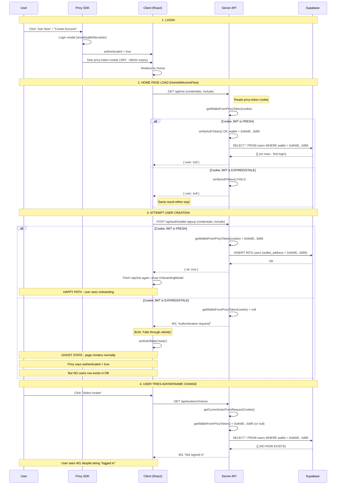
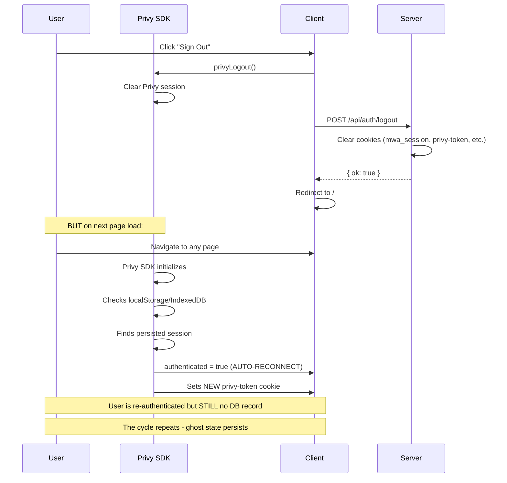

# Auth Flow Debug: Ghost Wallet Issue

The user authenticates via Privy (wallet `0x84D5...5D95`) but no `users` row exists in Supabase. All API calls return 401 because `getCurrentUserFromRequestCookie()` finds the wallet but no matching DB record.

## The Flow and Where It Breaks

## Why Logout Doesn't Fix It

## Root Cause

The `HomeWelcomeFlow` and `WalletConnectionHandler` rely on the `privy-token` **cookie** for server auth. But:

1. The Privy SDK sets `privy-token` as a short-lived JWT (~60 min)
2. The SDK refreshes it in the background, but cookie may be stale during the initial `/api/auth/wallet-signup` call
3. If signup returns 401, `HomeWelcomeFlow` falls through to `setAuthState('ready')` with no error shown
4. Once in ghost state, there's no recovery path -- the user creation is never retried

## Fix

Pass a fresh Privy access token via the `Authorization` header using `getAccessToken()` from `usePrivy()` in:

- `HomeWelcomeFlow.tsx` (the `/api/me` and `/api/auth/wallet-signup` calls)
- `WalletConnectionHandler.tsx` (same calls)
- `OnboardingModal.tsx` (avatar and profile creation calls)

This ensures the server always receives a valid, non-expired JWT regardless of cookie state.
