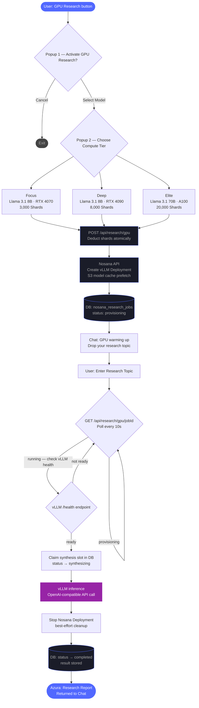

# Nosana GPU Research — Decentralized Compute for Deep Synthesis

Mental Wealth Academy's GPU Research system connects Azura directly to the Nosana network — a decentralized GPU marketplace built on Solana. When a topic demands more than pattern-matching against training data, Azura can borrow bare-metal compute from verified GPU providers and run a full open-source language model against it.

This is not a chatbot summarizing a search result. It is a 70-billion-parameter model performing multi-step academic synthesis on a dedicated GPU, spinning up on-demand, and returning a graduate-level research artifact directly into your conversation.

---

## Workflow



---

## Compute Tiers

| Tier | Model | GPU | VRAM | Shard Cost | Best For |
|------|-------|-----|------|------------|----------|
| Focus | Llama 3.1 8B Instruct (AWQ) | RTX 4070 | 12 GB | 3,000 | Fast summaries, structured outlines |
| Deep | Llama 3.1 8B | RTX 4090 | 18 GB | 8,000 | Multi-source integration, domain synthesis |
| Elite | Llama 3.1 70B Instruct (AWQ) | A100 | 40 GB | 20,000 | Graduate-level synthesis, cross-domain research |

All models are loaded from Nosana's pre-cached S3 infrastructure — bypassing HuggingFace download latency. Models arrive pre-quantized (AWQ INT4) for maximum throughput without sacrificing analytical depth.

---

## Why GPU Research

Standard research mode in Mental Wealth Academy draws on Eliza's training corpus and x402-gated source discovery. That pipeline is efficient and well-suited for most queries. But there are categories of research where inference quality scales directly with model size — topics that require:

- Synthesizing across multiple competing theoretical frameworks
- Resolving contradictions in empirical literature
- Producing citations-grade academic prose at density
- Reasoning through complex causal chains across domains (neuroscience + behavioral economics + clinical intervention, for example)

Running this on a 70-billion-parameter model rather than a cloud API gives the system two properties that matter: the model runs on hardware you borrowed from a public network, and the weights are open. The reasoning is not black-boxed behind a corporate inference endpoint.

---

## Technical Architecture

**Job Lifecycle:**

1. Azura submits a `POST /deployments/create` to the Nosana API with an opinionated vLLM job definition — including GPU market address, model path, and an S3 resource mount pointing to Nosana's model cache.
2. The deployment enters a provisioning queue on the network. A verified GPU provider picks it up and boots the container.
3. The application polls the deployment status every 10 seconds. Once `RUNNING` with a live endpoint, it checks vLLM's `/health` route before committing to inference — this guards against the container being up but the model still loading.
4. A database lock (`status = 'synthesizing'`) prevents duplicate inference calls if polling overlaps. Only one request claims the synthesis slot.
5. After synthesis, the deployment is stopped immediately. You pay only for the time the model ran.

**Shards as Compute Budget:**

Shards are MWA's proof-of-understanding token. Spending them on GPU research is intentional friction — it signals that the topic is worth dedicated compute, not a casual query. The cost is calibrated to the actual GPU-hour expense of running each tier.

---

## Environment Variable

Add to your `.env`:

```
NOSANA_API_KEY=nos_xxx_your_key_here
```

Obtain a key at [deploy.nosana.com](https://deploy.nosana.com) → Account → API Keys.
